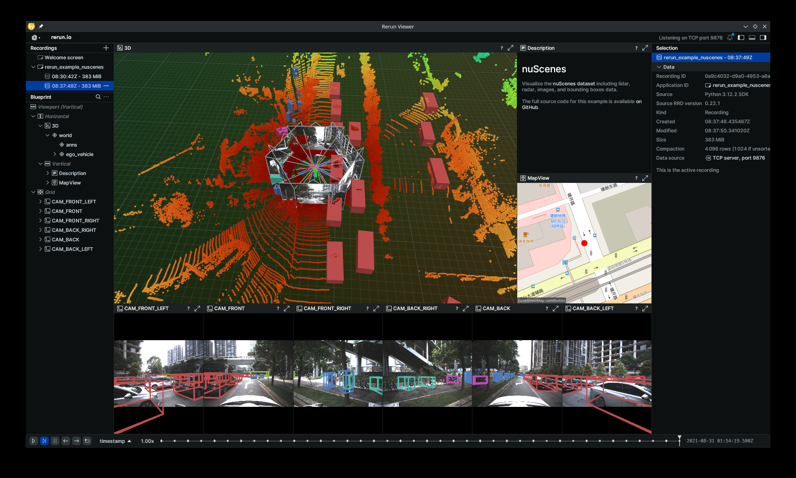

# SUScape to NuScenes Converter

**This project was partially developed with the assistance of AI tools.**

This project provides tools to convert the **SUScape** dataset into the **NuScenes** format (which can be parsed by [nuscenes-devkit](https://github.com/nutonomy/nuscenes-devkit)). It also includes features to visualize the dataset using [rerun](https://github.com/rerun-io/rerun).

Currently, the converter supports:

1. **Sensors Data**:
    - 1 × 128-channel LiDAR and 6 × RGB cameras
    - RADAR data is currently not converted
    - SUScape-specific sensors, including 6 infrared (IR) cameras and 4 auxiliary LiDARs, are not converted
2. **Annotations** (3D bounding boxes): Visibility, attributes and keyframes picking are not included, as they are not available in SUScape
3. **Calibration**: The vehicle coordinate system is defined to be identical to the LiDAR coordinate system, following SUScape

Converted dataset is sufficient for most tasks. However, full parity with the official NuScenes dataset is not achievable due to missing or unsupported data in SUScape.

## Installation

This project uses [uv](https://github.com/astral-sh/uv) for dependency management.

1. Clone the repository.
2. Install the package with dependencies:

```bash
uv sync --all-extras
```

If you only need the conversion functionality (without visualization):

```bash
uv sync 
```

Alternatively, `pip install -e .` works if you manage venv manually.

## Usage

### 1. Data Conversion (`susc2nusc`)

Run the converter to transform SUScape data into NuScenes format.

**Basic Usage:**

```bash
susc2nusc
```

This will process all scenes found in `data/suscape_scenes` and save them to `output/susc_nusc/v1.0-mini`.

**Specify Scenes:**
You can specify a list of scenes or a range:

```bash
# Single scene
susc2nusc --scenes scene-000001

# Range of scenes (e.g., 1 through 5)
susc2nusc --scenes scene-000001_000005

# Mixed
susc2nusc --scenes scene-000001 scene-000002_000005
```

**Custom Paths:**

```bash
susc2nusc \
  --susc-root /path/to/suscape \
  --output-root /path/to/output \
  --version v1.0-trainval
```

For full help:

```bash
susc2nusc --help
```

### 2. Visualization (`nusc_visualize`)

Visualize the converted data.

```bash
nusc_visualize --scene-name scene-000001
```

## Dataset Directory Structure

**Input (SUScape):**

```text
data/suscape_scenes/
└── scene-000001/
    ├── calib/
    ├── ego_pose/
    ├── label/
    ├── lidar_pose/
    ├── sensor/
    └── timestamp.txt
```

**Output (NuScenes):**

```text
output/susc_nusc/
├── v1.0-mini/          # NuScenes metadata tables (.json)
│   ├── attribute.json
│   ├── category.json
│   ├── ...
│   └── sample.json
└── sweeps/             # Sensor data
```

## Visualization



## TODO

- [x] Verify the coordinate system correctness
- [ ] Radar / Map
- [ ] canbus?
